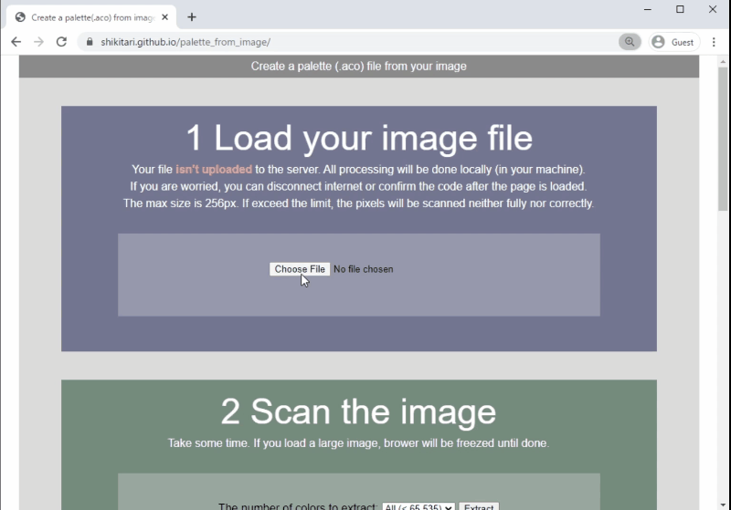

# Overview

* To create a palette (*.aco) file from your image file.
* Only HTML, plain JavaScript.
* Don't need to upload the image to the server.

## Demonsration

[The demo page](https://shikitari.github.io/palette_from_image/)
